# CMNE System Assessment: Users, Scenarios, UML, and Guide Diagrams

| Field | Value |
|---|---|
| Document ID | SRS-033-A |
| Version | 0.1 scenario baseline; implementation note 0.2 |
| Date | 2026-10-19 |
| Covers | SRS-033 v0.1→v0.2, Implementation Plan v0.1→v0.2 |
| Method | Describe the users first, write scenarios for them, draw the system in UML, and record every gap that drawing exposes as a numbered finding (section 5). Each finding names the requirement or task that closes it. |

**Scope note.** This assessment originally covered the specification package before code existed. The scenarios and UML below describe the **intended system**. The dated checkpoint below states what the current app actually supports; see [SRS-033 Implementation Status](SRS-033-Implementation-Status.md) for architecture and evidence.

### Scenario checkpoint (2026-10-19)

| Scenario | Current implementation | Missing from the described journey |
|---|---|---|
| S-01 First sample run | First launch creates/opens Mara and Len; Story, Pipeline, strain chart, and deterministic passage are available. | Read-only sample copy, welcome tour, glossary tooltips, live stage animation, and packaged GUI smoke. |
| S-02 Compose a scene | Create project; add and seal story/discourse drafts; connection validation and field errors. | Fixture and Mind palette editing, full concept/rule graph authoring, and multi-event seal transaction. |
| S-03 Tune the rule | Fork a sealed story event, edit draft copies, run a branch, scrub projections; sample C3 records retrospective links to S01/S02. | Dedicated rule-weight editor, full revision proposal workflow, and prescribed overlay inspection. |
| S-04 Repair a leak | Basic checker findings, stage status, and trace details exist. | Private-cognition detection, span highlighting, finding-to-node navigation, and full repair-first classification. |
| S-05 Remove anomaly | Fork from a selected event; draft suffix can be edited and sealed; branch compare gives basic divergence data. | Node deletion/diff-mode journey and complete dependent-event repair guidance. |
| S-06 Compare C1/C3 | Four condition branches and basic branch compare; separate strain chart per selected branch. | Graph diff marks and overlaid strain series. |
| S-07–S-09 Study | Markdown export of an individual run only. | Analysis plan, blinded export, evaluator response flow, import, and statistical report. |
| S-10–S-12 Adapter and replication | Offline template runs and saved run/projection hashes. | Model adapter, budget, cassette replay, adapter contract tests, and published-run replication workflow. |
| S-13 Recover draft | Draft JSON persists and the frontend attempts recovery; sealed events remain in project streams. | Timestamped recovery offer and end-to-end crash-recovery verification. |

The current run is synchronous and its Pipeline lens shows the saved result. The sequence and state diagrams that show a worker, live progress, cancellation, cassettes, or model API are proposed architecture. The project files are JSON/NDJSON rather than the YAML-oriented layout pictured in some diagrams. The sample's contract allows 0–1100 words, so the 700–1100-word study bound has not been reached.

**2026-10-20 update:** New Mara/Len samples now enforce 700–1100 words, and the offline realizer assembles roughly 800 words for each condition. Existing saved samples keep their old contract file but produce the longer passage when rerun. The blinded study and response scenarios remain unimplemented.

---

## 1. Who the system is for

The system serves five kinds of people. Each has a goal, a feeling they bring to the work, a fear, and something the design owes them.

| | P1 Author-Researcher | P2 Evaluator-Reader | P3 Maintainer-Developer | P4 Replicator-Reviewer | P5 Newcomer |
|---|---|---|---|---|---|
| **Who** | A fiction writer who also programs. Tests whether a theory of epiphany changes what readers experience. | A reader asked to read short passages and answer questions. Not a technologist. | A programmer who extends the engine: a new adapter, operator, or machine. | A peer reader of the white paper who wants to reproduce and challenge a result. | A colleague or student who wants to see what the engine is without setup. |
| **Goal** | Find out, with evidence, whether the mechanism does observable work. Keep authorial control of the scene and the voice. | Read cleanly, respond honestly, and finish without fatigue. | Change one layer without breaking the others. | Rerun a published run and get the same result, or find where it differs. | Understand the idea in ten minutes. |
| **Feels at the start** | Curious and invested; wary that the machine will flatten the prose or fake a result. | Mildly anxious about "getting it right." | Cautious about hidden coupling. | Skeptical, by training. | Unsure whether this is for them. |
| **Fears** | Opaque machinery. A language model quietly inventing canon. Losing work. A null result that cannot be explained. | Being led toward an answer. Theory jargon. Long sessions. | Reverse dependencies. Nondeterminism that surfaces in a test only on one machine. | Missing seeds, unrecorded model changes, cherry-picked outputs. | Jargon. A blank screen. |
| **Needs from the system** | Every claim traceable. Clear separation of what is fixed from what is editable. Failures that name the responsible layer. | Neutral presentation. A way to say "I see no difference." Cited spans, not essays. | Contracts, protocols, and tests that locate the boundary. | A run record, recorded model calls, and the analysis plan from before the data. | A working sample that runs first and explains afterward. |
| **Design response** | Sealed events, draft/fork model, trace queries, repair-first status, voice profile, autosave. | Static blinded set with a separate key, "no discernible difference" option, short protocol. | Ports and adapters, layer lint, record/replay adapters, golden fixtures. | Deterministic IDs and hashes, run records, record/replay, analysis plan hash. | Sample project, guided first run, plain-language glossary tooltips. |
| **Main requirements** | REQ-052, 062, 106, 157; GUI-005, 011, 012, 026 | REQ-109, 110, 118 | REQ-119, 122, 129, 139, 153 | REQ-124, 149–153, 161, 162 | GUI-038, 039 |

---

## 2. Scenarios

Each scenario follows one person through one task. The **Feels** rows record the emotional state the design must protect or improve.

### S-01 The newcomer sees Mara and Len run

| | |
|---|---|
| Persona | P5 Newcomer |
| Situation | Opens the application for the first time. No project exists. |
| Goal | See what the engine does. |
| Feels at start | Unsure. |
| Steps | 1. The welcome panel offers "Open the sample: Mara and Len." 2. A read-only copy opens in the workbench with the Story lens showing S01–S10. 3. The user presses Run. The pipeline graph lights up stage by stage. 4. The strain chart rises toward the threshold at S07–S09. 5. The user reads the realized passage. Findings are empty. 6. Glossary tooltips explain "model crisis" and "retrospective reinterpretation" in plain words. |
| Feels at end | "I can see what it is doing." |
| If it goes wrong | The sidecar fails to start: the status bar says so, shows the log path, and offers Retry. The sample remains readable. |
| Requirements | GUI-038, 039, 021, 022, 024 |

### S-02 The author composes a new scene from scratch

| | |
|---|---|
| Persona | P1 |
| Situation | Wants a second bounded scene, not Mara and Len. |
| Goal | Build the fixture visually and know it is valid before running. |
| Feels at start | Excited, and anxious about the formal vocabulary. |
| Steps | 1. Create a project. 2. In the Fixture lens, drag Actor, Place, and Object nodes from the palette. 3. Open Mind lens for Actor A; add a Concept node and an Interpretive Rule node; connect them. 4. Each edit validates in the sidecar; an invalid connection explains why it is refused. 5. In the Story lens, draft event nodes in causal order. 6. Press Seal: the events commit in one transaction. |
| Feels at end | In control; the structure is visible. |
| If it goes wrong | A rule uses a formula operator the language does not allow: the field shows the offending operator and the allowed list. The draft stays. |
| Requirements | GUI-006–013, REQ-147, 148, 156 |

### S-03 The author tunes Mara's interpretive rule and watches the past change

| | |
|---|---|
| Persona | P1 |
| Situation | Mara's `care` rule feels too weak to support the crisis. |
| Goal | Strengthen the pre-crisis model and see which earlier events it reaches. |
| Feels at start | Hopeful and precise. |
| Steps | 1. Fork from S07 (committed events are sealed). 2. Edit the rule weight in a draft copy of the conceptual model. 3. Run condition C3 on the fork. 4. Switch to the Story lens with retrospection arcs on; arcs run from the revision event back to S01 and S02. 5. Use the time scrubber to compare Mara's interpretation of S01 before and after. |
| Feels at end | "I can see exactly which memories moved." |
| If it goes wrong | No arcs appear: the finding "Reinterpretation reached no earlier event" names the diagnostic and the Mind-lens node to inspect. |
| Requirements | GUI-011, 015, 017, REQ-056, 101 |

### S-04 A run stops: the prose knew too much

| | |
|---|---|
| Persona | P1 |
| Situation | The pipeline stops at the checker with a repair-first status. |
| Goal | Understand why, and fix the right layer. |
| Feels at start | Frustrated; fears sentence-polishing will not help. |
| Steps | 1. The status names the finding: "Access to another actor's private cognition (REQ-087)." 2. The realization view highlights the sentence. 3. The status names the responsible layer from the symptom table: "Observation or discourse grounding." 4. Selecting the finding focuses the offending discourse act node. 5. The author withholds the claim in the act and re-runs. |
| Feels at end | Relieved: the error pointed at structure, not at wording. |
| If it goes wrong | The finding cannot be mapped to a layer: it is listed as "unclassified" and written to the run record for later review. |
| Requirements | REQ-087, 092, 146, 156, GUI-026, 027 |

### S-05 "What if the chair had not rocked?"

| | |
|---|---|
| Persona | P1 |
| Situation | Doubts that the anomaly in S05 is needed. |
| Goal | Try the alternative without destroying the original. |
| Feels at start | Curious; protective of the existing work. |
| Steps | 1. Select S05 in the Story lens. The node shows a lock mark: it is sealed. 2. Choose "Fork from here." A new branch opens with a draft copy of S05 onward. 3. Delete the anomaly in the draft. 4. Seal, run, and compare against the original branch in diff mode. |
| Feels at end | Safe to experiment. |
| If it goes wrong | A later event depends on the deleted one: the seal is refused with the broken precondition named. |
| Requirements | GUI-011, 012, 018, REQ-064–067 |

### S-06 Compare conditions C1 and C3

| | |
|---|---|
| Persona | P1 |
| Goal | See where the belief-only control and the conceptual-revision variant diverge. |
| Steps | 1. Open Branch compare. 2. The first diverging event is highlighted. 3. Diff mode marks added, removed, and changed nodes by shape and border, not color alone. 4. The strain chart overlays both branches. |
| Feels at end | The difference is concrete. |
| If it goes wrong | The branches are indistinguishable at the state level: the system reports it and the run is marked "repair first" (REQ-069, 106). |
| Requirements | REQ-066, 069, GUI-018, 024 |

### S-07 Prepare the blinded set

| | |
|---|---|
| Persona | P1 |
| Goal | Send evaluators passages that reveal nothing about condition. |
| Steps | 1. Confirm the analysis plan is recorded (hypotheses, measures, sample size, agreement metric). The plan's hash and time are stored. 2. Export the blinded set: randomized order, labels hidden, key in a separate file. 3. Confirm all rejected candidates remain in the project. |
| Feels at end | Confident the study is clean. |
| If it goes wrong | The export is refused because no analysis plan exists: the message says what to record first. |
| Requirements | REQ-108, 109, 114, 161 |

### S-08 The evaluator reads and responds

| | |
|---|---|
| Persona | P2 |
| Situation | Receives a folder of passages and a short protocol. |
| Goal | Read, answer a few questions, and be done. |
| Feels at start | A little anxious. |
| Steps | 1. Read a passage. 2. Answer the questions in the response file: which earlier detail changed meaning, what remains unresolved, how prepared the change felt, confidence. 3. "No discernible difference" is always an option. 4. Cite text spans. |
| Feels at end | Respected; never told what to find. |
| If it goes wrong | A response file has a missing field: import (S-09) reports the line and field; no data is silently dropped. |
| Requirements | REQ-110, 118 |

### S-09 Import responses and face a null result

| | |
|---|---|
| Persona | P1 |
| Goal | Learn what the data say, including when they disagree with the hypothesis. |
| Steps | 1. Import responses. 2. The report shows effect sizes with intervals, inter-rater agreement, and counts of rejected candidates. 3. If C3 does not beat C1, the report lists the alternatives in Architecture §14.11 (theory wrong, representation weak, prose failed, evaluation insensitive) and links the provenance needed to tell them apart. |
| Feels at end | Disappointed perhaps, but informed. |
| Requirements | REQ-111, 161, 162 |

### S-10 The model service fails or the budget runs out

| | |
|---|---|
| Persona | P1 |
| Situation | A run is midway when the model API times out. |
| Goal | Lose nothing and keep going. |
| Steps | 1. The pipeline pauses at the realization stage and shows "Adapter unavailable." 2. Committed events are intact. 3. The author switches to the template realizer or waits and resumes. 4. If the budget is reached, the run stops with a budget message and the spend so far. |
| Feels at end | Calm. |
| Requirements | REQ-099, 153, 154, GUI-035 |

### S-11 The maintainer adds an adapter

| | |
|---|---|
| Persona | P3 |
| Goal | Support a new model without touching the kernel. |
| Steps | 1. Implement `ProseRealizer`. 2. Register it in settings. 3. Run the adapter contract test suite. 4. Run `lint-imports`: no reverse dependency. 5. Record cassettes so CI runs offline. |
| Requirements | REQ-119, 122, 129, 139, 153 |

### S-12 The replicator reruns a published result

| | |
|---|---|
| Persona | P4 |
| Goal | Reproduce the numbers, or find the divergence. |
| Steps | 1. Open the published project folder. 2. Read the run record (versions, seed, settings). 3. Run in replay mode: no network calls, same text. 4. Compare projection hashes with the published ones. 5. If a hash differs, the first diverging event is named. |
| Requirements | REQ-015, 124, 149–153 |

### S-13 The application closes with unsaved work

| | |
|---|---|
| Persona | P1 |
| Situation | A crash or power loss during a long editing session. |
| Goal | Get the draft back. |
| Steps | 1. Reopen the project. 2. The app offers "Recover draft from 14:32." 3. The draft opens with undo history reset; sealed events are untouched. |
| Feels at end | Relief. |
| Requirements | GUI-005, 013, 035, REQ-127 |

---

## 3. UML

Mermaid has no native use case diagram. The use case diagram below uses flowchart notation with the standard roles: actors outside the boundary, use cases inside it.

### 3.1 Use case diagram

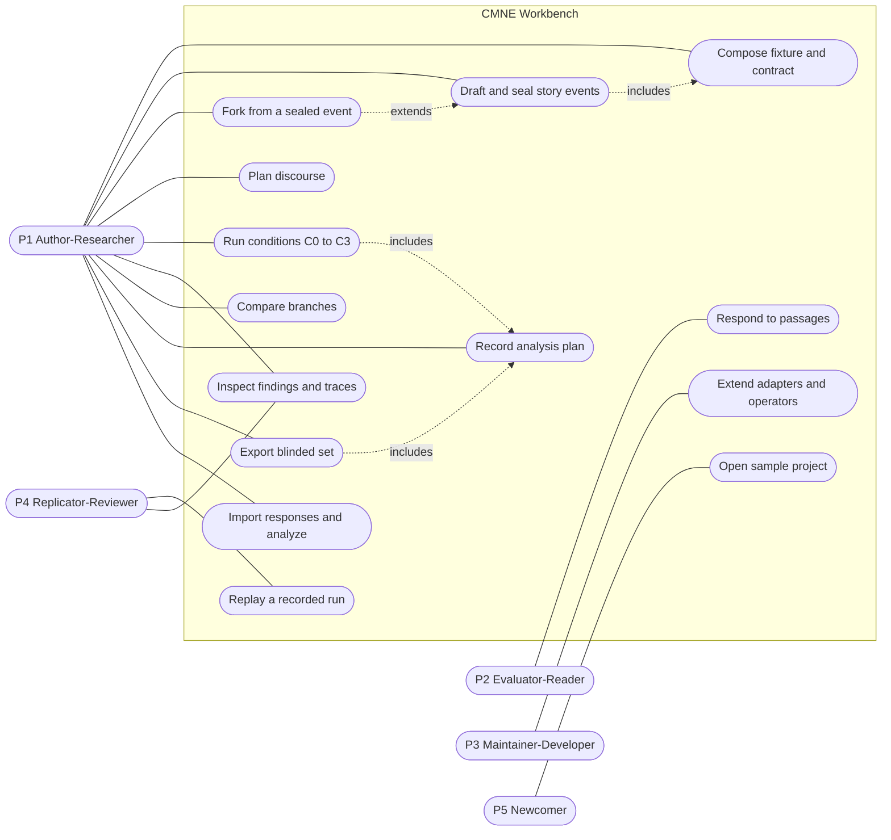
```mermaid
flowchart LR
    P1(["P1 Author-Researcher"])
    P2(["P2 Evaluator-Reader"])
    P3(["P3 Maintainer-Developer"])
    P4(["P4 Replicator-Reviewer"])
    P5(["P5 Newcomer"])
    subgraph CMNE["CMNE Workbench"]
        U1(["Open sample project"])
        U2(["Compose fixture and contract"])
        U3(["Draft and seal story events"])
        U4(["Fork from a sealed event"])
        U5(["Plan discourse"])
        U6(["Run conditions C0 to C3"])
        U7(["Inspect findings and traces"])
        U8(["Compare branches"])
        U9(["Record analysis plan"])
        U10(["Export blinded set"])
        U11(["Import responses and analyze"])
        U12(["Replay a recorded run"])
        U13(["Extend adapters and operators"])
        U14(["Respond to passages"])
    end
    P5 --- U1
    P1 --- U2
    P1 --- U3
    P1 --- U4
    P1 --- U5
    P1 --- U6
    P1 --- U7
    P1 --- U8
    P1 --- U9
    P1 --- U10
    P1 --- U11
    P2 --- U14
    P4 --- U12
    P4 --- U7
    P3 --- U13
    U3 -. "includes" .-> U2
    U6 -. "includes" .-> U9
    U10 -. "includes" .-> U9
    U4 -. "extends" .-> U3
```

*Use cases by actor.* P2 interacts only through exported files. Dotted lines mark include and extend relations.

### 3.2 Package diagram

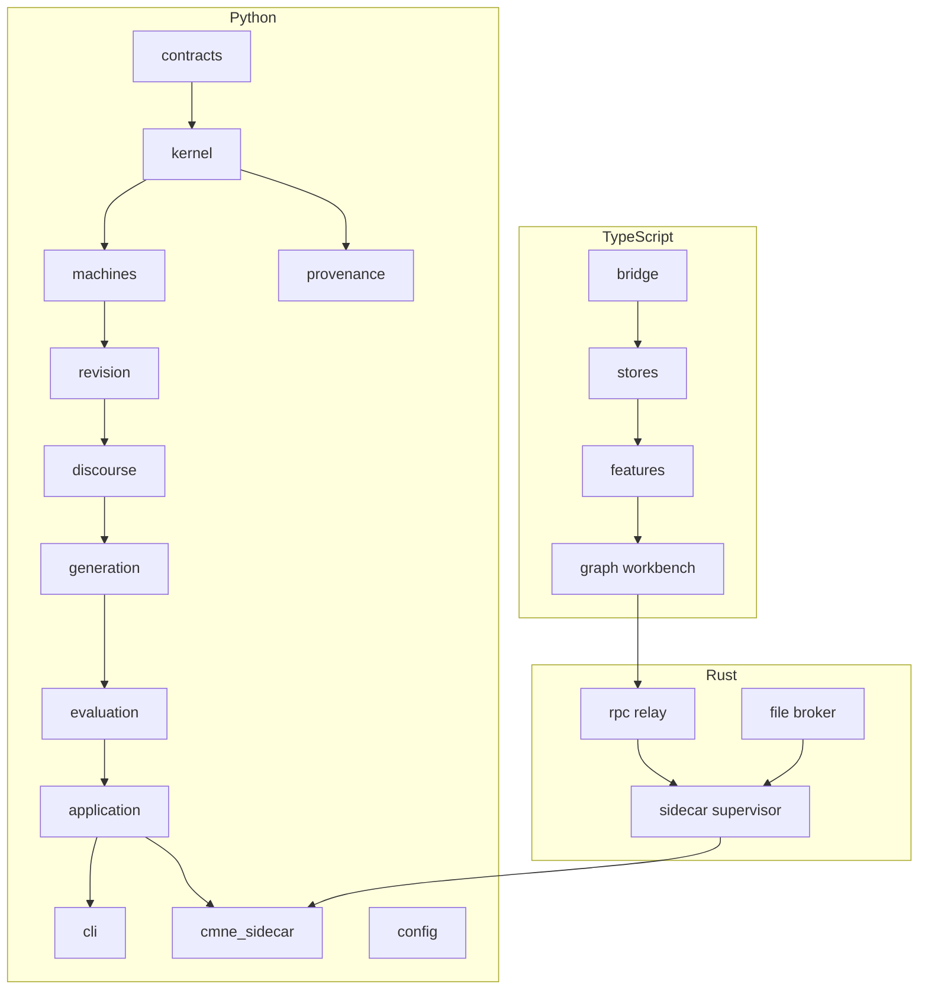
```mermaid
flowchart TD
    subgraph Py["Python"]
        contracts --> kernel --> machines --> revision --> discourse --> generation --> evaluation --> application
        application --> cli
        application --> sidecar["cmne_sidecar"]
        config
        kernel --> provenance
    end
    subgraph Rs["Rust"]
        supervisor["sidecar supervisor"]
        relay["rpc relay"]
        files["file broker"]
    end
    subgraph Js["TypeScript"]
        bridge --> stores --> features --> gw["graph workbench"]
    end
    gw --> relay --> supervisor --> sidecar
    files --> supervisor
```

*Package dependencies.* Arrows point toward the dependency. The only crossing between languages is the Rust relay.

### 3.3 Class diagrams

#### 3.3.1 Events and contracts

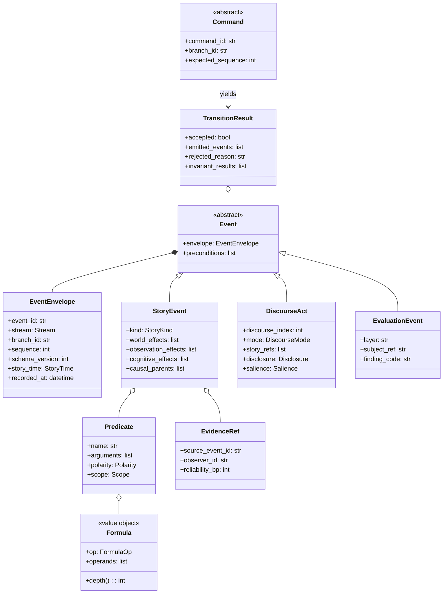
```mermaid
classDiagram
    class EventEnvelope {
        +event_id: str
        +stream: Stream
        +branch_id: str
        +sequence: int
        +schema_version: int
        +story_time: StoryTime
        +recorded_at: datetime
    }
    class Event {
        <<abstract>>
        +envelope: EventEnvelope
        +preconditions: list
    }
    class StoryEvent {
        +kind: StoryKind
        +world_effects: list
        +observation_effects: list
        +cognitive_effects: list
        +causal_parents: list
    }
    class DiscourseAct {
        +discourse_index: int
        +mode: DiscourseMode
        +story_refs: list
        +disclosure: Disclosure
        +salience: Salience
    }
    class EvaluationEvent {
        +layer: str
        +subject_ref: str
        +finding_code: str
    }
    class Predicate {
        +name: str
        +arguments: list
        +polarity: Polarity
        +scope: Scope
    }
    class Formula {
        <<value object>>
        +op: FormulaOp
        +operands: list
        +depth(): int
    }
    class EvidenceRef {
        +source_event_id: str
        +observer_id: str
        +reliability_bp: int
    }
    class Command {
        <<abstract>>
        +command_id: str
        +branch_id: str
        +expected_sequence: int
    }
    class TransitionResult {
        +accepted: bool
        +emitted_events: list
        +rejected_reason: str
        +invariant_results: list
    }
    Event <|-- StoryEvent
    Event <|-- DiscourseAct
    Event <|-- EvaluationEvent
    Event *-- EventEnvelope
    StoryEvent o-- Predicate
    Predicate o-- Formula
    StoryEvent o-- EvidenceRef
    Command ..> TransitionResult : yields
    TransitionResult o-- Event
```

*Contracts for events and commands.* `Formula` and the basis-point reliability field close findings F-01 and F-02.

#### 3.3.2 Minds, revision, and provenance

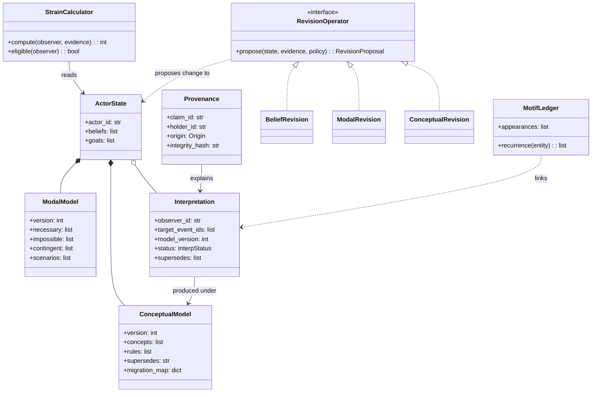
```mermaid
classDiagram
    class ActorState {
        +actor_id: str
        +beliefs: list
        +goals: list
    }
    class ModalModel {
        +version: int
        +necessary: list
        +impossible: list
        +contingent: list
        +scenarios: list
    }
    class ConceptualModel {
        +version: int
        +concepts: list
        +rules: list
        +supersedes: str
        +migration_map: dict
    }
    class Interpretation {
        +observer_id: str
        +target_event_ids: list
        +model_version: int
        +status: InterpStatus
        +supersedes: list
    }
    class Provenance {
        +claim_id: str
        +holder_id: str
        +origin: Origin
        +integrity_hash: str
    }
    class StrainCalculator {
        +compute(observer, evidence): int
        +eligible(observer): bool
    }
    class RevisionOperator {
        <<interface>>
        +propose(state, evidence, policy): RevisionProposal
    }
    class BeliefRevision
    class ModalRevision
    class ConceptualRevision
    class MotifLedger {
        +appearances: list
        +recurrence(entity): list
    }
    ActorState *-- ModalModel
    ActorState *-- ConceptualModel
    ActorState o-- Interpretation
    Interpretation --> ConceptualModel : produced under
    Provenance --> Interpretation : explains
    StrainCalculator --> ActorState : reads
    RevisionOperator <|.. BeliefRevision
    RevisionOperator <|.. ModalRevision
    RevisionOperator <|.. ConceptualRevision
    RevisionOperator ..> ActorState : proposes change to
    MotifLedger ..> Interpretation : links
```

*The cognitive core.* Three operators share one interface. `MotifLedger` is a derived projection (REQ-158).

#### 3.3.3 Discourse, generation, and evaluation

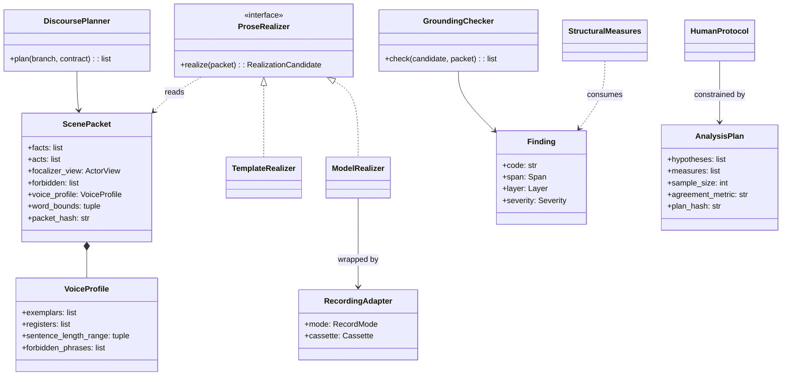
```mermaid
classDiagram
    class DiscoursePlanner {
        +plan(branch, contract): list
    }
    class ScenePacket {
        +facts: list
        +acts: list
        +focalizer_view: ActorView
        +forbidden: list
        +voice_profile: VoiceProfile
        +word_bounds: tuple
        +packet_hash: str
    }
    class VoiceProfile {
        +exemplars: list
        +registers: list
        +sentence_length_range: tuple
        +forbidden_phrases: list
    }
    class ProseRealizer {
        <<interface>>
        +realize(packet): RealizationCandidate
    }
    class TemplateRealizer
    class ModelRealizer
    class RecordingAdapter {
        +mode: RecordMode
        +cassette: Cassette
    }
    class GroundingChecker {
        +check(candidate, packet): list
    }
    class Finding {
        +code: str
        +span: Span
        +layer: Layer
        +severity: Severity
    }
    class AnalysisPlan {
        +hypotheses: list
        +measures: list
        +sample_size: int
        +agreement_metric: str
        +plan_hash: str
    }
    class StructuralMeasures
    class HumanProtocol
    DiscoursePlanner --> ScenePacket
    ScenePacket *-- VoiceProfile
    ProseRealizer <|.. TemplateRealizer
    ProseRealizer <|.. ModelRealizer
    ModelRealizer --> RecordingAdapter : wrapped by
    ProseRealizer ..> ScenePacket : reads
    GroundingChecker --> Finding
    HumanProtocol --> AnalysisPlan : constrained by
    StructuralMeasures ..> Finding : consumes
```

*From plan to judged text.* `RecordingAdapter` records and replays model calls (REQ-153). `AnalysisPlan` locks the study before data arrive (REQ-161).

#### 3.3.4 Application and sidecar

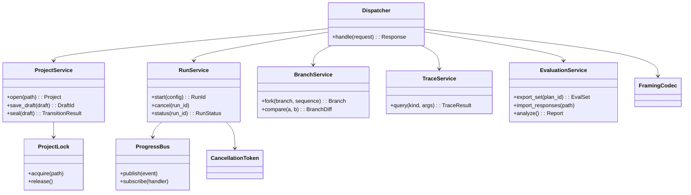
```mermaid
classDiagram
    class ProjectService {
        +open(path): Project
        +save_draft(draft): DraftId
        +seal(draft): TransitionResult
    }
    class RunService {
        +start(config): RunId
        +cancel(run_id)
        +status(run_id): RunStatus
    }
    class BranchService {
        +fork(branch, sequence): Branch
        +compare(a, b): BranchDiff
    }
    class TraceService {
        +query(kind, args): TraceResult
    }
    class EvaluationService {
        +export_set(plan_id): EvalSet
        +import_responses(path)
        +analyze(): Report
    }
    class ProgressBus {
        +publish(event)
        +subscribe(handler)
    }
    class CancellationToken
    class ProjectLock {
        +acquire(path)
        +release()
    }
    class Dispatcher {
        +handle(request): Response
    }
    class FramingCodec
    RunService --> ProgressBus
    RunService --> CancellationToken
    ProjectService --> ProjectLock
    Dispatcher --> ProjectService
    Dispatcher --> RunService
    Dispatcher --> BranchService
    Dispatcher --> TraceService
    Dispatcher --> EvaluationService
    Dispatcher --> FramingCodec
```

*Application facade and sidecar transport.* Services own behavior; the dispatcher only maps methods to services.

#### 3.3.5 Frontend graph workbench

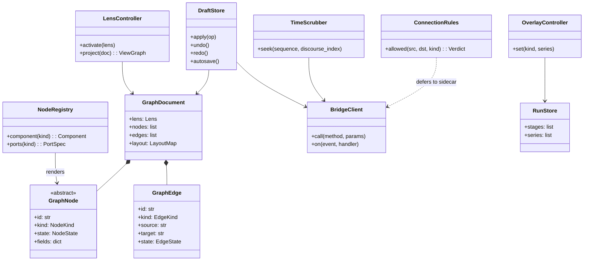
```mermaid
classDiagram
    class GraphDocument {
        +lens: Lens
        +nodes: list
        +edges: list
        +layout: LayoutMap
    }
    class GraphNode {
        <<abstract>>
        +id: str
        +kind: NodeKind
        +state: NodeState
        +fields: dict
    }
    class GraphEdge {
        +id: str
        +kind: EdgeKind
        +source: str
        +target: str
        +state: EdgeState
    }
    class NodeRegistry {
        +component(kind): Component
        +ports(kind): PortSpec
    }
    class ConnectionRules {
        +allowed(src, dst, kind): Verdict
    }
    class DraftStore {
        +apply(op)
        +undo()
        +redo()
        +autosave()
    }
    class LensController {
        +activate(lens)
        +project(doc): ViewGraph
    }
    class OverlayController {
        +set(kind, series)
    }
    class TimeScrubber {
        +seek(sequence, discourse_index)
    }
    class BridgeClient {
        +call(method, params)
        +on(event, handler)
    }
    class RunStore {
        +stages: list
        +series: list
    }
    GraphDocument *-- GraphNode
    GraphDocument *-- GraphEdge
    NodeRegistry --> GraphNode : renders
    ConnectionRules ..> BridgeClient : defers to sidecar
    DraftStore --> GraphDocument
    LensController --> GraphDocument
    OverlayController --> RunStore
    TimeScrubber --> BridgeClient
    DraftStore --> BridgeClient
```

*Workbench model.* The frontend never decides whether an edge is valid; `ConnectionRules` asks the sidecar. Section 4 and the Visual Language document define the node and edge kinds.

### 3.4 Component diagram

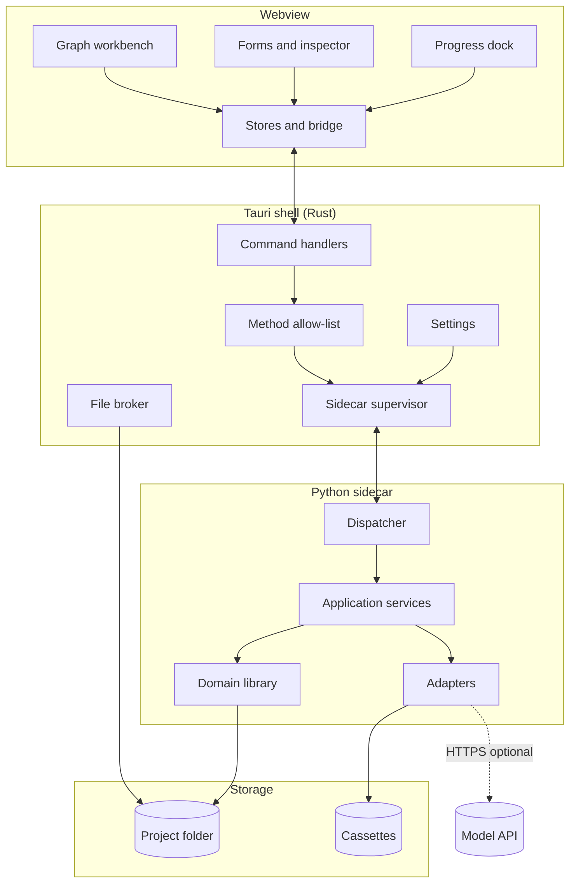
```mermaid
flowchart TB
    subgraph UI["Webview"]
        W1["Graph workbench"]
        W2["Forms and inspector"]
        W3["Progress dock"]
        W4["Stores and bridge"]
    end
    subgraph SH["Tauri shell (Rust)"]
        S1["Command handlers"]
        S2["Method allow-list"]
        S3["Sidecar supervisor"]
        S4["File broker"]
        S5["Settings"]
    end
    subgraph SC["Python sidecar"]
        C1["Dispatcher"]
        C2["Application services"]
        C3["Domain library"]
        C4["Adapters"]
    end
    subgraph ST["Storage"]
        D1[("Project folder")]
        D2[("Cassettes")]
    end
    W1 --> W4
    W2 --> W4
    W3 --> W4
    W4 <--> S1
    S1 --> S2 --> S3
    S3 <--> C1
    S4 --> D1
    S5 --> S3
    C1 --> C2 --> C3
    C3 --> D1
    C4 --> D2
    C2 --> C4
    C4 -. "HTTPS optional" .-> API[("Model API")]
```

*Components and ownership.* The file broker and the domain library both touch the project folder, which is why a project lock is required (finding F-05).

### 3.5 Deployment diagram

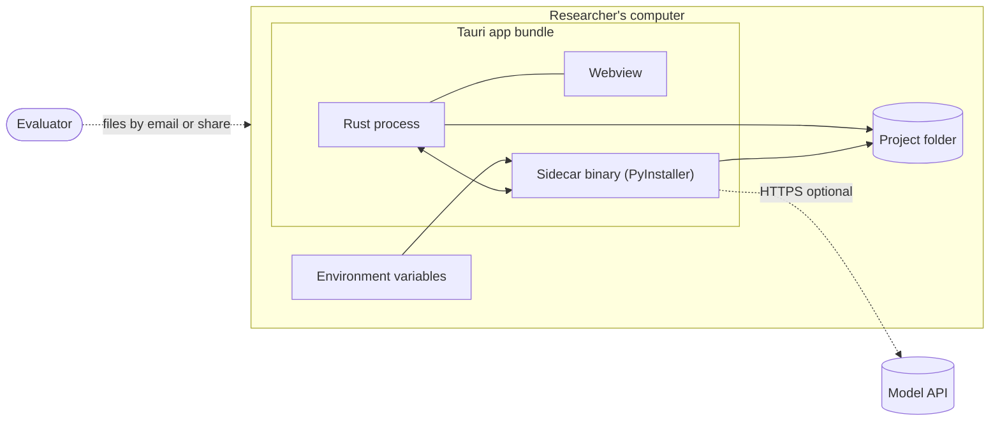
```mermaid
flowchart LR
    subgraph Host["Researcher's computer"]
        subgraph App["Tauri app bundle"]
            Rust["Rust process"]
            Web["Webview"]
            Side["Sidecar binary (PyInstaller)"]
        end
        Proj[("Project folder")]
        Keys["Environment variables"]
    end
    Rust --- Web
    Rust <--> Side
    Side --> Proj
    Rust --> Proj
    Keys --> Side
    Side -. "HTTPS optional" .-> API[("Model API")]
    Eval(["Evaluator"]) -. "files by email or share" .-> Host
```

*Deployment.* Everything runs locally. Evaluators never run the application.

### 3.6 Sequence diagrams

#### 3.6.1 Edit, validate, save, seal

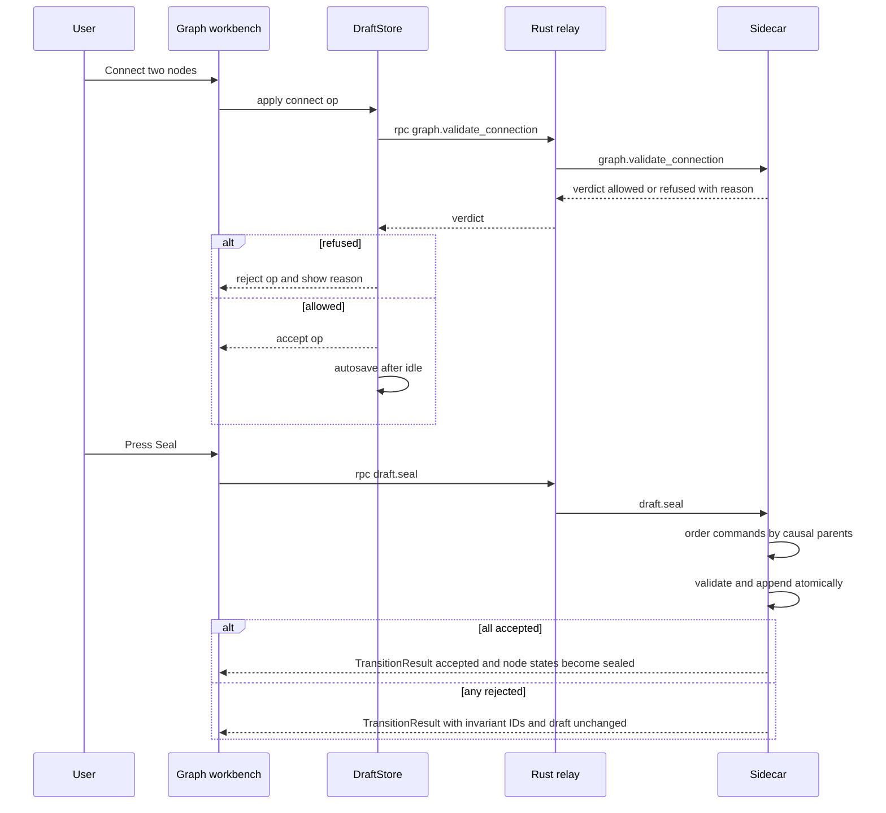
```mermaid
sequenceDiagram
    participant U as User
    participant G as Graph workbench
    participant D as DraftStore
    participant R as Rust relay
    participant S as Sidecar
    U->>G: Connect two nodes
    G->>D: apply connect op
    D->>R: rpc graph.validate_connection
    R->>S: graph.validate_connection
    S-->>R: verdict allowed or refused with reason
    R-->>D: verdict
    alt refused
        D-->>G: reject op and show reason
    else allowed
        D-->>G: accept op
        D->>D: autosave after idle
    end
    U->>G: Press Seal
    G->>R: rpc draft.seal
    R->>S: draft.seal
    S->>S: order commands by causal parents
    S->>S: validate and append atomically
    alt all accepted
        S-->>G: TransitionResult accepted and node states become sealed
    else any rejected
        S-->>G: TransitionResult with invariant IDs and draft unchanged
    end
```

*Authoring loop.* The sidecar decides every connection and every seal. The draft survives a failed seal.

#### 3.6.2 Fork from a sealed event

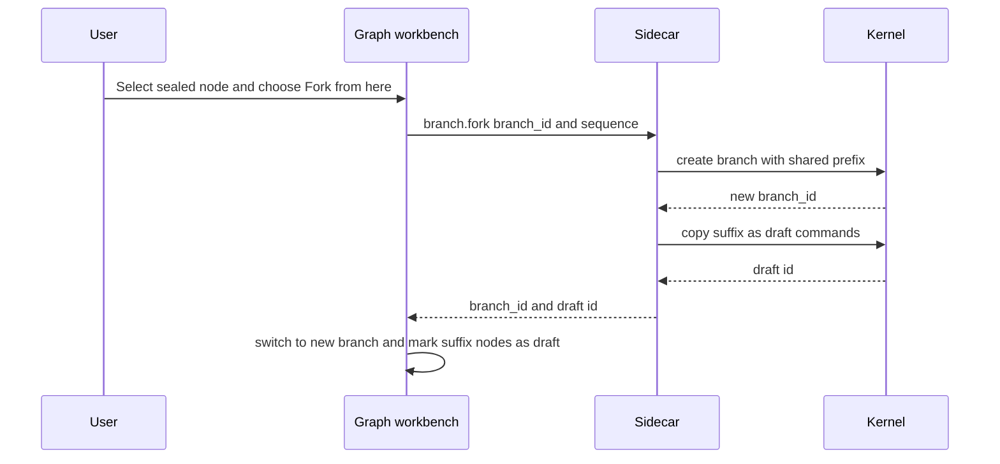
```mermaid
sequenceDiagram
    participant U as User
    participant G as Graph workbench
    participant S as Sidecar
    participant K as Kernel
    U->>G: Select sealed node and choose Fork from here
    G->>S: branch.fork branch_id and sequence
    S->>K: create branch with shared prefix
    K-->>S: new branch_id
    S->>K: copy suffix as draft commands
    K-->>S: draft id
    S-->>G: branch_id and draft id
    G->>G: switch to new branch and mark suffix nodes as draft
```

*Fork semantics.* Sealed events are never edited; the user edits a draft copy on a new branch.

#### 3.6.3 Crisis detection and revision choice

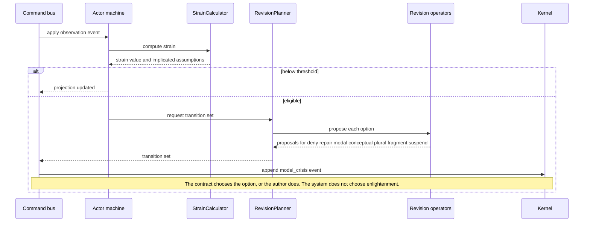
```mermaid
sequenceDiagram
    participant C as Command bus
    participant A as Actor machine
    participant X as StrainCalculator
    participant P as RevisionPlanner
    participant Op as Revision operators
    participant K as Kernel
    C->>A: apply observation event
    A->>X: compute strain
    X-->>A: strain value and implicated assumptions
    alt below threshold
        A-->>C: projection updated
    else eligible
        A->>P: request transition set
        P->>Op: propose each option
        Op-->>P: proposals for deny repair modal conceptual plural fragment suspend
        P-->>C: transition set
        C->>K: append model_crisis event
        Note over C,K: The contract chooses the option, or the author does. The system does not choose enlightenment.
    end
```

*Crisis flow.* It shows that eligibility opens a set of options and does not select one (REQ-048).

#### 3.6.4 Checker rejection and layer diagnosis

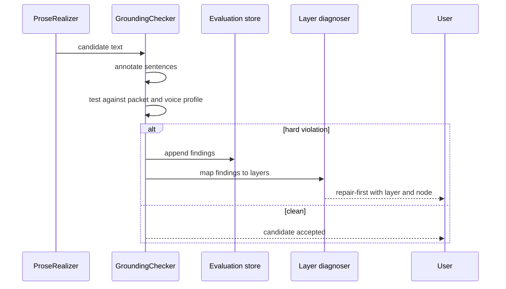
```mermaid
sequenceDiagram
    participant R as ProseRealizer
    participant K as GroundingChecker
    participant E as Evaluation store
    participant L as Layer diagnoser
    participant U as User
    R->>K: candidate text
    K->>K: annotate sentences
    K->>K: test against packet and voice profile
    alt hard violation
        K->>E: append findings
        K->>L: map findings to layers
        L-->>U: repair-first with layer and node
    else clean
        K-->>U: candidate accepted
    end
```

*Rejection path.* Findings are stored, never discarded, and each maps to a layer.

#### 3.6.5 Sidecar crash and recovery

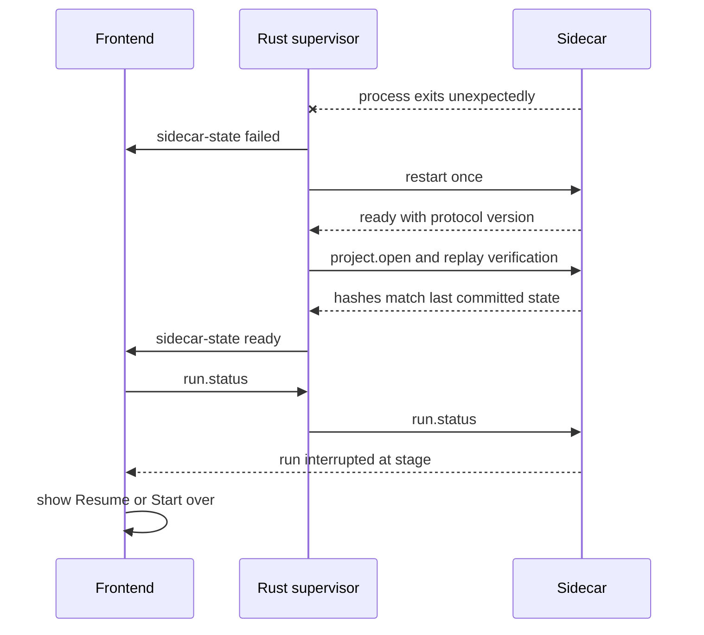
```mermaid
sequenceDiagram
    participant F as Frontend
    participant R as Rust supervisor
    participant S as Sidecar
    S--xR: process exits unexpectedly
    R->>F: sidecar-state failed
    R->>S: restart once
    S-->>R: ready with protocol version
    R->>S: project.open and replay verification
    S-->>R: hashes match last committed state
    R->>F: sidecar-state ready
    F->>R: run.status
    R->>S: run.status
    S-->>F: run interrupted at stage
    F->>F: show Resume or Start over
```

*Recovery.* Committed events are authoritative; the run restarts from the last completed stage.

### 3.7 State diagrams

#### 3.7.1 Node lifecycle in the editor

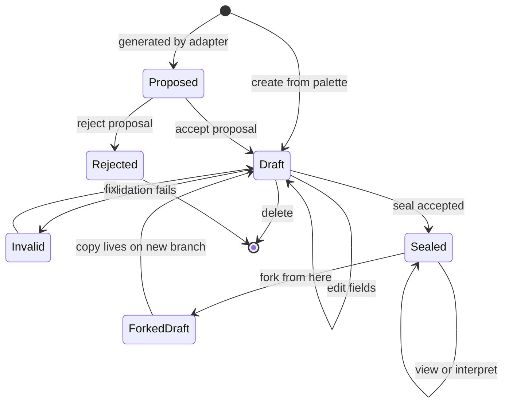
```mermaid
stateDiagram-v2
    [*] --> Draft: create from palette
    Draft --> Draft: edit fields
    Draft --> Invalid: validation fails
    Invalid --> Draft: fix
    Draft --> Sealed: seal accepted
    Draft --> [*]: delete
    Sealed --> Sealed: view or interpret
    Sealed --> ForkedDraft: fork from here
    ForkedDraft --> Draft: copy lives on new branch
    Proposed --> Draft: accept proposal
    Proposed --> Rejected: reject proposal
    Rejected --> [*]
    [*] --> Proposed: generated by adapter
```

*A node is a draft, sealed, or proposed.* Only sealed nodes are canon. A generated node starts as Proposed.

#### 3.7.2 Branch lifecycle

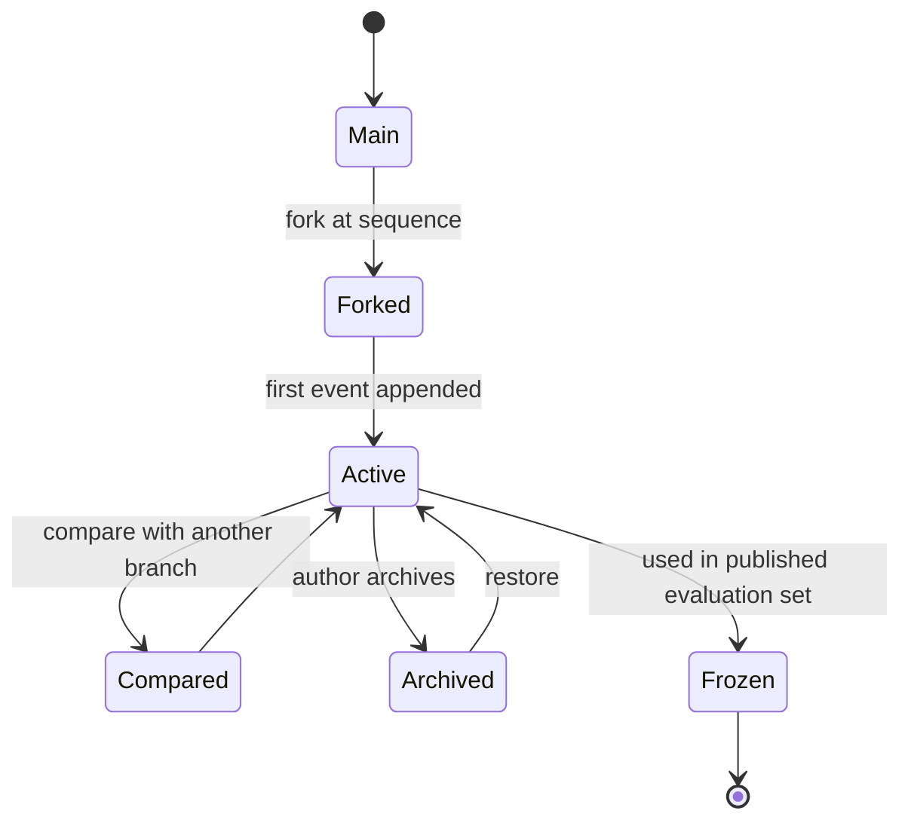
```mermaid
stateDiagram-v2
    [*] --> Main
    Main --> Forked: fork at sequence
    Forked --> Active: first event appended
    Active --> Compared: compare with another branch
    Compared --> Active
    Active --> Archived: author archives
    Archived --> Active: restore
    Active --> Frozen: used in published evaluation set
    Frozen --> [*]
```

*Branches are never merged.* A branch used in a published evaluation set becomes frozen.

#### 3.7.3 Sidecar supervisor

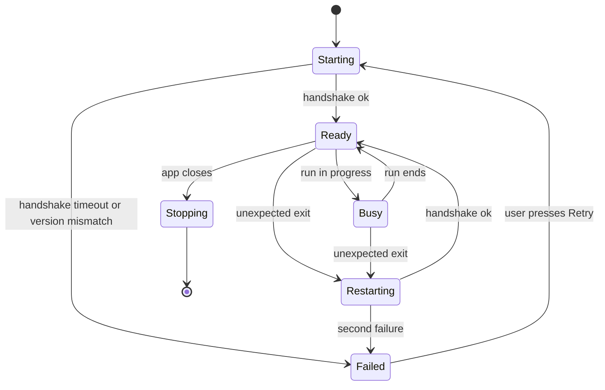
```mermaid
stateDiagram-v2
    [*] --> Starting
    Starting --> Ready: handshake ok
    Starting --> Failed: handshake timeout or version mismatch
    Ready --> Busy: run in progress
    Busy --> Ready: run ends
    Ready --> Restarting: unexpected exit
    Busy --> Restarting: unexpected exit
    Restarting --> Ready: handshake ok
    Restarting --> Failed: second failure
    Failed --> Starting: user presses Retry
    Ready --> Stopping: app closes
    Stopping --> [*]
```

*Supervisor policy.* One automatic restart, then user-controlled retry.

(The observer-model lifecycle appears in SRS §8.4, and the run lifecycle in Implementation Plan §5.7.)

### 3.8 Activity diagram: from idea to evaluated passage

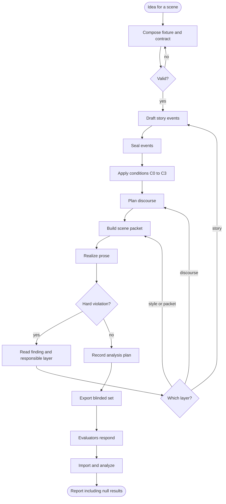
```mermaid
flowchart TD
    A(["Idea for a scene"]) --> B["Compose fixture and contract"]
    B --> C{"Valid?"}
    C -->|no| B
    C -->|yes| D["Draft story events"]
    D --> E["Seal events"]
    E --> F["Apply conditions C0 to C3"]
    F --> G["Plan discourse"]
    G --> H["Build scene packet"]
    H --> I["Realize prose"]
    I --> J{"Hard violation?"}
    J -->|yes| K["Read finding and responsible layer"]
    K --> L{"Which layer?"}
    L -->|story| D
    L -->|discourse| G
    L -->|style or packet| H
    J -->|no| M["Record analysis plan"]
    M --> N["Export blinded set"]
    N --> O["Evaluators respond"]
    O --> P["Import and analyze"]
    P --> Q(["Report including null results"])
```

*End-to-end activity.* The loop in the middle sends a failure back to the layer that caused it, not to the wording.

### 3.9 Entity-relationship diagram: the project folder

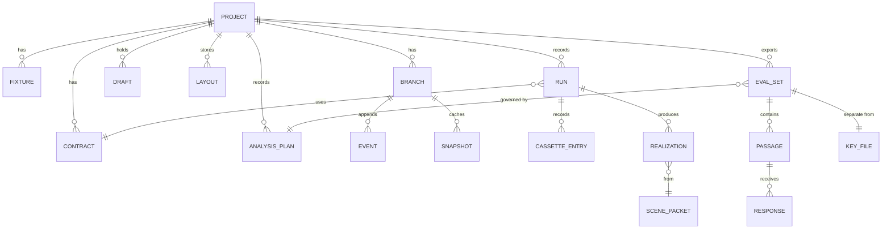
```mermaid
erDiagram
    PROJECT ||--o{ FIXTURE : has
    PROJECT ||--o{ CONTRACT : has
    PROJECT ||--o{ BRANCH : has
    PROJECT ||--o{ DRAFT : holds
    PROJECT ||--o{ LAYOUT : stores
    PROJECT ||--o{ ANALYSIS_PLAN : records
    PROJECT ||--o{ RUN : records
    PROJECT ||--o{ EVAL_SET : exports
    BRANCH ||--o{ EVENT : appends
    BRANCH ||--o{ SNAPSHOT : caches
    RUN }o--|| CONTRACT : uses
    RUN ||--o{ CASSETTE_ENTRY : records
    RUN ||--o{ REALIZATION : produces
    REALIZATION }o--|| SCENE_PACKET : from
    EVAL_SET ||--o{ PASSAGE : contains
    EVAL_SET ||--|| KEY_FILE : "separate from"
    EVAL_SET }o--|| ANALYSIS_PLAN : "governed by"
    PASSAGE ||--o{ RESPONSE : receives
```

*What the project folder holds.* Layout and drafts are stored beside the domain data but are never part of it. Layout is view data and drafts are unsealed work.

---

## 4. What the diagrams showed

Drawing the system exposed the gaps below. Each row names the diagram that exposed it and the requirement or task that closes it. IDs for SRS requirements refer to SRS v0.2. Severity: **H** blocks correct implementation or the research claim; **M** causes rework or user harm; **L** is polish.

| ID | Finding | Exposed by | Sev | Closed by |
|---|---|---|---|---|
| F-01 | `Formula`, `Condition`, and `Scenario` appear in the schemas but have no grammar or evaluation rules. | Class diagram 3.3.1 | H | REQ-147, 148; task T-02a |
| F-02 | Floating-point confidence values make projection hashes differ across platforms. | Class diagram 3.3.1 | H | REQ-149; AC-27 |
| F-03 | Time- or random-based event IDs break regeneration of identical branches. | Sequence 3.6.1 | H | REQ-150; AC-28 |
| F-04 | The loader sits in the application layer but earlier tasks need it. | Package 3.2 | M | Plan T-05 moves it to `kernel/fixtures.py` |
| F-05 | Two writers (CLI and sidecar, or two app windows) can corrupt a project. | Component 3.4 | H | REQ-152; AC-29 |
| F-06 | The GUI never said what "modify" means for a sealed event. | State 3.7.1, sequence 3.6.2 | H | GUI-010, 011; REQ-064 |
| F-07 | Reads during a run and writes during a run are not distinguished. | Sequence 3.6.1 | M | REQ-166; Plan §3.3 |
| F-08 | No protocol version handshake between shell and sidecar. | Sequence 3.6.5 | M | REQ-165; AC-41 |
| F-09 | Old event schemas cannot be read after a schema change. | Class diagram 3.3.1 | M | REQ-151; AC-35 |
| F-10 | Model output cannot be replayed, so a published result is not reproducible. | Class diagram 3.3.3 | H | REQ-153; AC-30 |
| F-11 | Project files are untrusted input (YAML, paths, size). | Component 3.4 | M | REQ-155; AC-32 |
| F-12 | A crash loses the draft. | State 3.7.1; scenario S-13 | M | GUI-005; AC-38 |
| F-13 | Nothing carries the author's voice into the packet; style state alone cannot. | Class diagram 3.3.3 | H | REQ-157; AC-33 |
| F-14 | The study has no analysis plan, sample-size rationale, or agreement metric. | Class diagram 3.3.3 | H | REQ-161, 162; AC-34 |
| F-15 | No mapping from components to the narrative theory they implement. | Package 3.2 | M | REQ-159; SRS Appendix A |
| F-16 | Objects such as the chair and bowl carry meaning across the scene, but no projection tracks them. | Class diagram 3.3.2 | M | REQ-158 |
| F-17 | Evaluator workload and accessibility are unspecified. | Scenario S-08 | M | REQ-160 |
| F-18 | Error codes exist but plain-language explanation and next action do not. | Scenarios S-02, S-04 | M | REQ-156; AC-36 |
| F-19 | The graph editor has no keyboard, screen-reader, or table alternative. | Class diagram 3.3.5 | H | GUI-032–034 |
| F-20 | The first model call can overspend. | Scenario S-10 | M | REQ-154; AC-31 |
| F-21 | Large graphs lose legibility. | Class diagram 3.3.5 | M | GUI-019, 020 |
| F-22 | Open question OQ-11 (one Tension machine or two) blocks the tension chart design. | Class diagram 3.3.2 | M | REQ-036 (resolved: one machine, two views) |
| F-23 | Open question OQ-12 (does the controller have state) is unresolved. | Component 3.4 | L | Resolved: the controller stays outside the six machines; Plan ADR-005 |
| F-24 | A user new to modal logic meets unexplained terms. | Scenario S-01 | M | GUI-039; SRS Appendix B |
| F-25 | Acceptance criteria cover correctness but not performance or recovery. | Sequence 3.6.5 | M | AC-37, AC-38; GAC-17 |
| F-26 | Three prior-art claims in the notes were unchecked. | SRS §10.2 | M | Resolved: SRS §10.2 and Appendix A |

---

## 5. Block diagrams for the user guide

These diagrams use plain words. They explain how to think about the system, not how it is built.

### G1 How the engine thinks

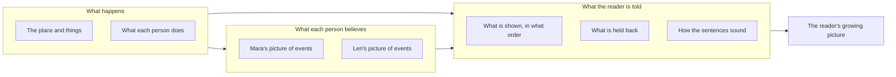
```mermaid
flowchart LR
    subgraph World["What happens"]
        W1["The place and things"]
        W2["What each person does"]
    end
    subgraph Minds["What each person believes"]
        M1["Mara's picture of events"]
        M2["Len's picture of events"]
    end
    subgraph Telling["What the reader is told"]
        T1["What is shown, in what order"]
        T2["What is held back"]
        T3["How the sentences sound"]
    end
    World --> Minds
    World --> Telling
    Minds --> Telling
    Telling --> R["The reader's growing picture"]
```

*Three layers.* The world holds facts. Each character holds a separate picture of those facts. The telling decides what the reader sees.

### G2 From idea to passage

```mermaid
flowchart LR
    A["1 Describe the people and place"] --> B["2 Set the goal for the scene"]
    B --> C["3 Write the events"]
    C --> D["4 Choose what changes in Mara's mind"]
    D --> E["5 Decide what the reader learns, and when"]
    E --> F["6 Generate the passage"]
    F --> G["7 Check it against the facts"]
    G --> H["8 Let readers judge it"]
```

*Eight steps.* The engine checks facts. Readers judge the writing.

### G3 What you can change, and what is sealed

```mermaid
flowchart TB
    subgraph Free["You can change freely"]
        F1["Drafts"]
        F2["Layout on the canvas"]
        F3["Discourse plans before running"]
    end
    subgraph Sealed["Sealed once committed"]
        S1["Story events"]
        S2["Earlier interpretations"]
    end
    subgraph Way["To change something sealed"]
        W1["Fork from that event"]
        W2["Edit the draft copy"]
        W3["Compare with the original"]
    end
    F1 -->|"Seal"| S1
    S1 --> W1 --> W2 --> W3
```

*Sealing protects the record.* To try a different past, fork; the original stays.

### G4 Three kinds of change in a character's mind

```mermaid
flowchart TB
    A["Belief change<br/>She learns he planned to leave"] --> B["Possibility change<br/>She admits that care can also be avoidance"]
    B --> C["Concept change<br/>The word care no longer sorts her memories"]
    A -. "alone is a fact revelation" .-> X["Earlier events keep their meaning"]
    C -. "reaches back" .-> Y["Earlier events can mean something else"]
```

*Why the engine tracks three levels.* A fact can arrive without changing what the past means. A concept change reaches back.

### G5 Where your files live

```mermaid
flowchart TB
    P["Project folder"] --> F["fixtures"]
    P --> C["contracts"]
    P --> B["branches<br/>story, discourse, evaluation"]
    P --> D["drafts<br/>unsealed work"]
    P --> L["layout<br/>canvas positions"]
    P --> A["analysis plan"]
    P --> R["runs<br/>settings, seeds, model calls"]
    P --> E["evaluation<br/>blinded sets, key, responses"]
    P --> X["exports"]
```

*One folder per project.* Move or back up the folder and everything travels with it.

### G6 The workbench at a glance

```mermaid
flowchart TB
    subgraph Top["Top bar"]
        T1["Project"] --- T2["Import"] --- T3["Export"] --- T4["Run"] --- T5["Cancel"] --- T6["Status"]
    end
    subgraph Mid["Middle"]
        direction LR
        L["Navigator<br/>lenses and branches"] --- Cv["Canvas<br/>the graph you edit and watch"] --- I["Inspector<br/>fields and errors"]
    end
    subgraph Bot["Bottom dock"]
        B1["Pipeline progress"] --- B2["Strain chart"] --- B3["Findings"]
    end
    Top --> Mid --> Bot
```

*Four regions.* Choose on the left, work in the middle, inspect on the right, watch runs at the bottom.

### G7 Reading a run

```mermaid
flowchart LR
    S1["Validate contract"] --> S2["Replay prefix"] --> S3["Fork conditions"] --> S4["Apply revision"] --> S5["Plan discourse"] --> S6["Build packet"] --> S7["Realize"] --> S8["Check"] --> S9["Measure"] --> S10["Export"]
    K1["Pending: outlined, empty"]
    K2["Running: solid with moving mark"]
    K3["Passed: filled with check"]
    K4["Failed: filled with cross"]
    K5["Cancelled: filled with dash"]
```

*Ten stages and five states.* Each state has its own shape mark, so color is never the only cue.

### G8 When something goes wrong, look here

```mermaid
flowchart LR
    A["Wrong place or object state"] --> A2["Story events"]
    B["A character knows too much"] --> B2["Observation or what was disclosed"]
    C["The turn feels arbitrary"] --> C2["How the old model was established"]
    D["Facts change but not meaning"] --> D2["Revision design"]
    E["The passage explains its own point"] --> E2["Discourse or style policy"]
    F["Lovely sentences, no consequence"] --> F2["Contract or tension"]
```

*Symptom to layer.* Fix the structure the symptom points to. Polishing sentences does not repair a structural fault.

### G9 Who knows what

```mermaid
flowchart TB
    subgraph Truth["Story facts"]
        T1["The note is under the bowl"]
        T2["Len wrote it"]
    end
    subgraph Mara["Mara knows"]
        M1["Len is leaving overnight"]
    end
    subgraph Len["Len knows"]
        L1["He wrote the note"]
        L2["He postponed the talk"]
    end
    subgraph Reader["Reader has been told"]
        R1["The bowl, early and lightly"]
        R2["The first line of the note"]
    end
    Truth -. "only if seen or told" .-> Mara
    Truth -. "only if seen or told" .-> Len
    Truth -. "only if shown in the telling" .-> Reader
```

*Separate horizons.* No one learns a fact without a path to it. The checker enforces this.
